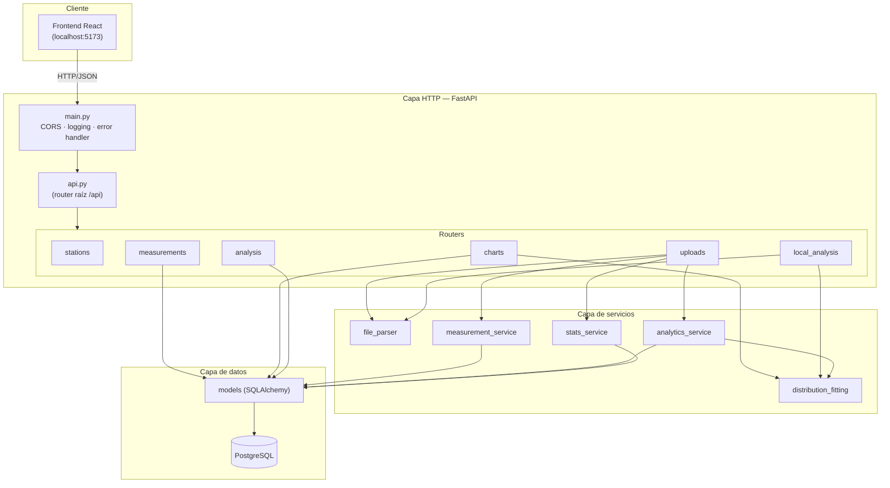
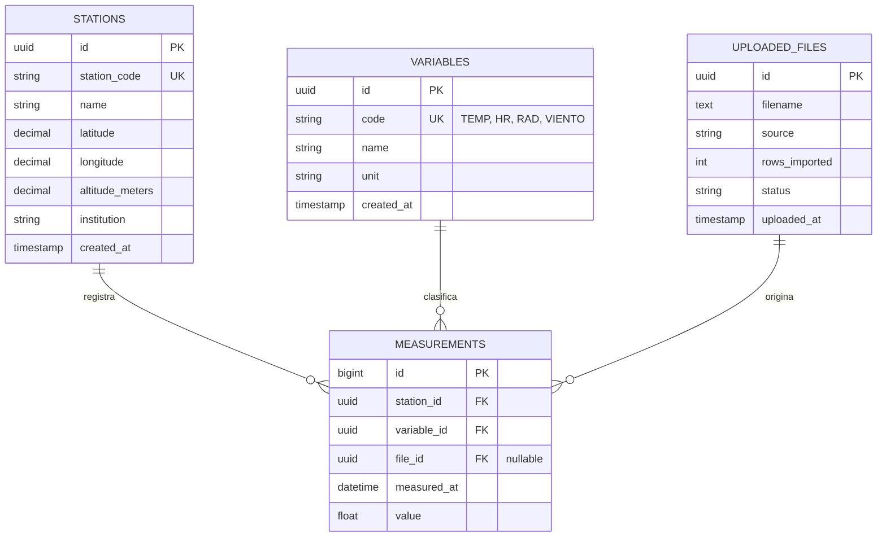
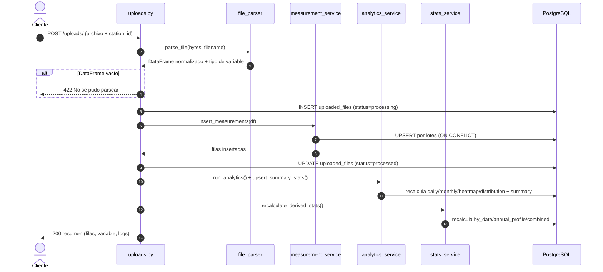

# Arquitectura del Backend — Meteorological API

API REST construida con **FastAPI + SQLAlchemy + PostgreSQL** para ingerir,
almacenar y analizar series temporales meteorológicas (temperatura, humedad
relativa, radiación y viento) provenientes de archivos CSV/Excel.

---

## 1. Stack tecnológico

| Capa            | Tecnología                                  |
|-----------------|---------------------------------------------|
| Framework web   | FastAPI                                     |
| Servidor ASGI   | Uvicorn                                     |
| ORM             | SQLAlchemy 2.x                              |
| Base de datos   | PostgreSQL (driver `psycopg2`)              |
| Cálculo numérico| NumPy, pandas, SciPy                        |
| Parseo archivos | pandas + openpyxl                           |
| Configuración   | python-dotenv (variables de entorno)        |

---

## 2. Estructura del proyecto

```
Backend/
├── app/
│   ├── main.py                 # Entrypoint FastAPI: CORS, logging, manejo de errores
│   ├── core/
│   │   └── config.py           # Settings validados desde .env (fail-fast)
│   ├── db/
│   │   ├── database.py         # engine, SessionLocal, Base, get_db()
│   │   └── db.py               # Registro de todos los modelos en el metadata
│   ├── models/                 # Modelos SQLAlchemy (tablas)
│   ├── schemas/                # Schemas Pydantic (validación E/S)
│   ├── api/
│   │   ├── api.py              # Router raíz: monta todos los sub-routers
│   │   └── routes/
│   │       ├── stations.py     # CRUD de estaciones y variables
│   │       ├── uploads.py      # Carga de archivos + pipeline de ingesta
│   │       ├── measurements.py # CRUD/acceso a mediciones
│   │       ├── charts.py       # Endpoints de análisis y gráficas
│   │       ├── analysis.py     # Análisis de calidad / huecos
│   │       ├── local_analysis.py # Análisis ad-hoc sin persistir en BD
│   │       └── _shared.py      # Helpers comunes (filtros de fecha, color)
│   └── services/
│       ├── file_parser.py          # Detección de formato y normalización
│       ├── measurement_service.py  # Inserción masiva (UPSERT) de mediciones
│       ├── analytics_service.py    # Precálculo de estadísticas y distribución
│       ├── stats_service.py        # Estadísticas derivadas (by_date, perfiles…)
│       └── distribution_fitting.py # Matemática de ajuste FDP (Gaussiana/Beta)
└── requirements.txt
```

### Arquitectura por capas

> Regla de dependencias: las rutas dependen de los servicios y de los modelos;
> los servicios dependen de los modelos. **Ningún servicio importa desde la capa
> de rutas** (la matemática de ajuste vive en `services/distribution_fitting.py`).



---

## 3. Modelo de datos

### 3.1 Entidades núcleo (datos de origen)

`measurements` es la tabla transaccional principal. Cada medición pertenece a una
estación y a una variable, y opcionalmente a un archivo de origen. Tiene una
restricción única lógica `(station_id, variable_id, measured_at)` que habilita el
UPSERT en la ingesta.



### 3.2 Tablas de estadísticas precalculadas

Estas tablas se recalculan tras cada carga exitosa para servir las gráficas de
forma instantánea (sin recomputar sobre `measurements`). Todas se relacionan con
`STATIONS` y `VARIABLES`. `COMBINED_STATS` referencia dos variables (T y HR).

```mermaid
erDiagram
    STATIONS ||--o{ SUMMARY_STATS : "agrega"
    VARIABLES ||--o{ SUMMARY_STATS : "agrega"
    STATIONS ||--o{ DAILY_STATS : "agrega"
    VARIABLES ||--o{ DAILY_STATS : "agrega"
    STATIONS ||--o{ MONTHLY_STATS : "agrega"
    VARIABLES ||--o{ MONTHLY_STATS : "agrega"
    STATIONS ||--o{ HEATMAP_STATS : "agrega"
    VARIABLES ||--o{ HEATMAP_STATS : "agrega"
    STATIONS ||--o{ BY_DATE_STATS : "agrega"
    VARIABLES ||--o{ BY_DATE_STATS : "agrega"
    STATIONS ||--o{ ANNUAL_PROFILE_STATS : "agrega"
    VARIABLES ||--o{ ANNUAL_PROFILE_STATS : "agrega"
    STATIONS ||--o{ DISTRIBUTION_ANALYSIS : "agrega"
    VARIABLES ||--o{ DISTRIBUTION_ANALYSIS : "agrega"
    STATIONS ||--o{ COMBINED_STATS : "agrega"
    VARIABLES ||--o{ COMBINED_STATS : "T y HR"

    SUMMARY_STATS {
        uuid station_id PK,FK
        uuid variable_id PK,FK
        bigint count
        float min_value
        float max_value
        float avg_value
        float std_value
        datetime date_start
        datetime date_end
        datetime updated_at
    }
    DAILY_STATS {
        uuid station_id PK,FK
        uuid variable_id PK,FK
        date day PK
        float avg_value
        float min_value
        float max_value
        float std_value
        int record_count
    }
    MONTHLY_STATS {
        uuid station_id PK,FK
        uuid variable_id PK,FK
        int year PK
        int month PK
        float avg_value
        float min_value
        float max_value
        float std_value
        int record_count
    }
    HEATMAP_STATS {
        uuid station_id PK,FK
        uuid variable_id PK,FK
        int month PK
        int hour PK
        float avg_value
    }
    BY_DATE_STATS {
        uuid station_id PK,FK
        uuid variable_id PK,FK
        string period_type PK "hour/day/month/year"
        datetime period_start PK
        float avg_value
        float min_value
        float max_value
        int record_count
    }
    ANNUAL_PROFILE_STATS {
        uuid station_id PK,FK
        uuid variable_id PK,FK
        int doy PK "día del año 1-366"
        float avg_value
        float min_value
        float max_value
        float q25_value
        float q75_value
        int n_years
    }
    DISTRIBUTION_ANALYSIS {
        uuid id PK
        uuid station_id FK
        uuid variable_id FK
        string distribution_type "gaussian/beta"
        float n_components
        text components_json
        text fdp_json
        float r2
        float mse
        text anomalies_json
        float completitud_pct
        datetime date_start
        datetime date_end
        datetime calculated_at
    }
    COMBINED_STATS {
        uuid station_id PK,FK
        uuid variable_id_temp PK,FK
        uuid variable_id_hr PK,FK
        numeric altitude_meters
        text density_json
        float humect_pct
        int humect_count
        int total_paired
        text habs_monthly_json
        text mobility_json
        text scatter_json
        datetime calculated_at
    }
```



---

## 4. Flujo de ingesta de un archivo

`POST /api/uploads/` es el corazón del sistema. Detecta el formato, normaliza,
inserta con UPSERT y dispara el precálculo de estadísticas. El precálculo está en
bloques `try/except` separados: si falla, el archivo igualmente queda persistido.



---

## 5. Análisis de distribución (FDP)

El ajuste de la **función de densidad de probabilidad** vive en
`services/distribution_fitting.py` (funciones puras, sin BD ni HTTP):

- **Temperatura → mezcla de Gaussianas** (`_fit_gaussian_components`).
- **Humedad relativa → Betas generalizadas** (`_fit_beta_components`), incluyendo
  una curva de saturación al 100%.
- Métricas de calidad objetivo: `MSE ≤ 1E-5`, `R² ≥ 0.95`, error `± 1E-3`.

El resultado se persiste en `distribution_analysis` y se sirve por
`GET /api/measurements/stats` como "precalculado".

---

## 6. Configuración (variables de entorno)

Definidas en `.env` (ver `.env.example`) y validadas al arranque en
`core/config.py`:

| Variable        | Descripción                                          | Por defecto             |
|-----------------|------------------------------------------------------|-------------------------|
| `DATABASE_URL`  | Cadena de conexión PostgreSQL (**obligatoria**)      | —                       |
| `DEBUG`         | Expone stacktraces en respuestas (solo desarrollo)   | `false`                 |
| `CORS_ORIGINS`  | Orígenes permitidos, separados por coma              | `http://localhost:5173` |
| `LOG_LEVEL`     | Nivel de logging (DEBUG/INFO/WARNING/ERROR)          | `INFO`                  |

---

## 7. Puesta en marcha

```bash
cd Backend
python -m venv .venv
.venv/Scripts/activate        # Windows
pip install -r requirements.txt
cp .env.example .env          # y editar DATABASE_URL
uvicorn app.main:app --reload --port 8000
```

- Documentación interactiva (Swagger): `http://localhost:8000/docs`
- Referencia de endpoints: [API.md](API.md)
